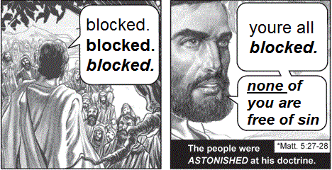

# blocked blocked blocked

Are you experiencing a twitter pile on? Use this to block the people who are
harassing you and everyone engaging with those tweets.

The best way to stop a pile on is:

1. Immediately [set your account to private](https://help.twitter.com/en/safety-and-security/how-to-make-twitter-private-and-public)
to stop further engagement and prevent scrreenshots.
2. Block everyone who is harassing you in replies to your tweet
3. Block everyone who liked the tweets harassing you
4. Block everyone who retweeted the tweets harassing you
5. Block everyone who RTd or liked or comments on the RTs above.

You can use this library to automate steps 2-5 above.
